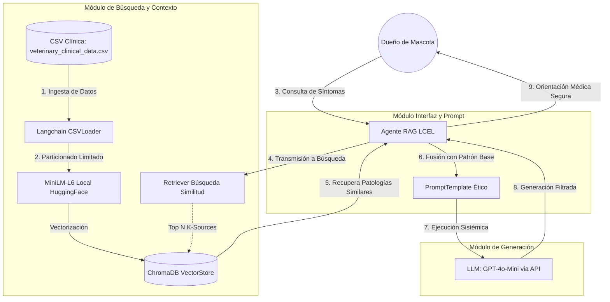

# Informe Técnico: Agente RAG para Asistencia Veterinaria

**Proyecto:** Asistente Virtual Inteligente con Retrieval-Augmented Generation (RAG)
**Asignatura:** ING SOLU CON IA _(Evaluación 1)_

---

## 1. Planteamiento del Caso Organizacional

El presente proyecto nace bajo la necesidad de una clínica veterinaria de implementar una solución de Inteligencia Artificial en su portal web. El requerimiento principal del caso es desplegar un Chatbot capaz de brindar orientación y cuidados básicos para mascotas (perros, gatos, etc.) basándose estrictamente en conocimiento clínico real, manteniendo en todo momento estándares éticos inquebrantables. El asistente tiene restringida la facultad de emitir diagnósticos médicos definitivos, actuando exclusivamente como un orientador que deriva los casos severos a la asistencia profesional humana.

## 2. Arquitectura de la Solución Propuesta

Para satisfacer los requerimientos organizacionales, se optó por una arquitectura modular que incorpora un modelo de Generación Aumentada por Recuperación (RAG). Esta decisión técnica permite apalancar el poder de los Grandes Modelos de Lenguaje (LLMs) sin exponer los datos nativos de la clínica a servicios de terceros de manera permanente. 

Nuestra arquitectura híbrida se divide en los siguientes módulos operacionales:

- **Módulo de Ingesta y Recuperación:** Liderado por una base de datos vectorial in-memory continua (`ChromaDB`). En sincronía con la librería de embeddings locales `all-MiniLM-L6-v2` ejecutada en la CPU. Se decidió usar un entorno offline mediante *Sentence-Transformers* para la vectorización garantizando costo cero por volumen de datos ("Low-Cost Manteinance") y confidencialidad absoluta sobre los expedientes clínicos.
- **Módulo de Procesamiento Semántico:** Un pipeline moderno implementado con LCEL de LangChain, el cual orquesta las consultas de los dueños de mascotas aplicándoles filtros de *Similarity Search* recuperando los historiales más similares.
- **Módulo de Generación:** Se asigna a **`gpt-4o-mini`** vía la API de inferencia de GitHub Models por tratarse del modelo más coste-eficiente contemporáneo. Se aisla en la nube únicamente para ensamblar semánticamente la respuesta final bajo parámetros controlados.

### 2.1 Diagrama de Arquitectura

A continuación, la representación visual del flujo de datos cruzado e integración de componentes clave:

## 3. Configuración de Flujos RAG

El ciclo vital de la información se inicia en el `CSVLoader` con la lectura y estandarización del `veterinary_clinical_data.csv`. Debido a protecciones API (Rate Limits ambientales) y eficiencia probatoria, se configuró el sistema para retener únicamente las primeras 100 filas de los casos críticos, asegurando fluidez en el vector *Space*. Estas filas de texto rico son fragmentadas y absorbidas automáticamente en el subdirectorio de Chroma.

Gracias a este esquema integral, al momento en el que el dueño de la mascota formula la pregunta, el flujo RAG efectúa un filtrado semántico e integra ese conocimiento como bloque inyectado a las capacidades base del LLM.

## 4. Diseño del Prompt y Coherencia Datos-Respuesta

Para gobernar el LLM y prevenir el fenómeno de la "alucinación" —particularmente grave bajo un contexto de asistencia animal— se elaboró un potente PromptTemplate fundado en directrices sistémicas claras.

El texto instruccional impone obligatoriedad en tres ejes:
1. NUNCA diagnosticar al paciente.
2. Alertar ante síntomas severos demandando visita veterinaria urgente.
3. El uso obligatorio del "{context}" inyectado por RAG para contextualizar la afección de la mascota.

**Impacto y Credibilidad:** Al forzar de manera sintáctica una dependencia sobre el historial recuperado (los registros en CSV de animales, razas y sus síntomas), el modelo determina su nivel de coherencia sin inventar información no avalada clínicamente. Esta táctica erradica las salidas generativas sin sentido y salvaguarda directamente el prestigio institucional de la veterinaria; el asistente digital acata estrictamente su rol como un ente de primera línea de triage, apoyado de evidencias matemáticas, y transfiere humanamente los casos médicos al plano clínico profesional.

---
